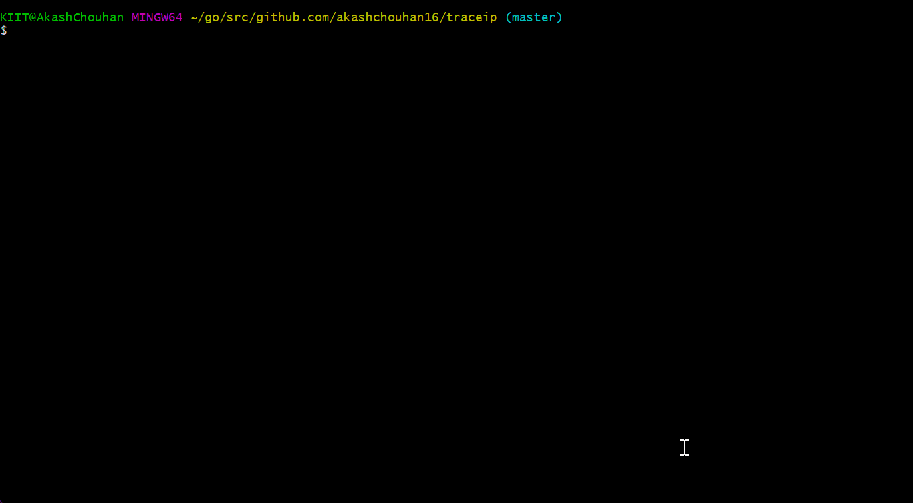
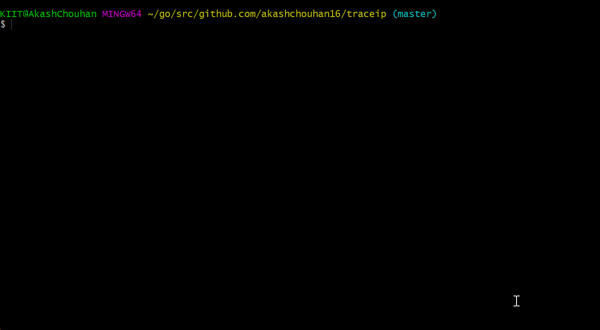

# 🌏 TraceIP

A Command line tool built with **[Go](https://go.dev/ "Go Lang")** to perform geolocation lookups for IP addresses. 

Retrieve information such as host, country, region, city, latitude, longitude and associated organisation with an IP address.

```bash
$ traceip
```

## 📝 Quick Setup

> **Learn more about go workspace and compilation and installation [here](https://go.dev/doc/tutorial/compile-install "Visit go.dev docs").**

- Clone the repo, install and compile traceip binary:
  ```bash
  $ git clone https://github.com/akashchouhan16/traceip.git
  $ cd traceip
  $ go install
  $ go build
  ```
- Run **traceip** 
  ```
  $ traceip OR traceip.exe
  ```
* **System Prerequisites**: **Go 1.17** or above installed.
  
> **Note**: Incase any issue is faced with the setup, make sure the `GOPATH` is set to pwd and `go version` is updated. Refer the **[Go compilation guide](https://go.dev/doc/tutorial/compile-install "Visit go.dev docs").**

---

* **🔮 Preview: GO build & run the traceip binary:**
  

* **🔮 Preview: `traceip trace <IPv4/IPv6>`**
  
---

### 📦 Application Details
#### License
**[MIT License](https://github.com/akashchouhan16/traceip/blob/master/LICENSE "View License")**

#### Author
**[Akash Chouhan](https://github.com/akashchouhan16/ "akashchouhan16")**
